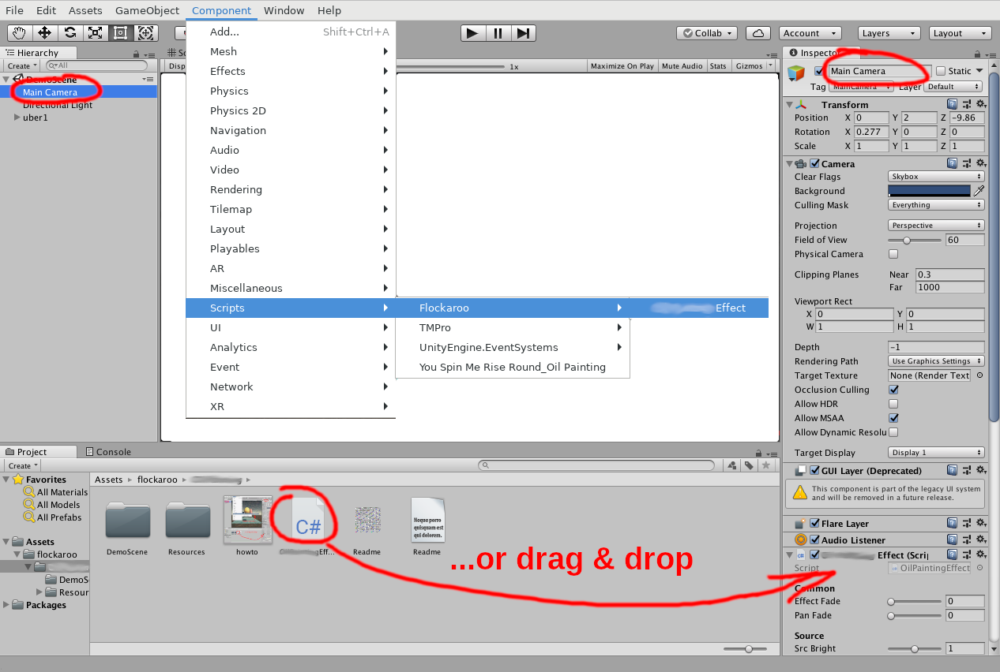
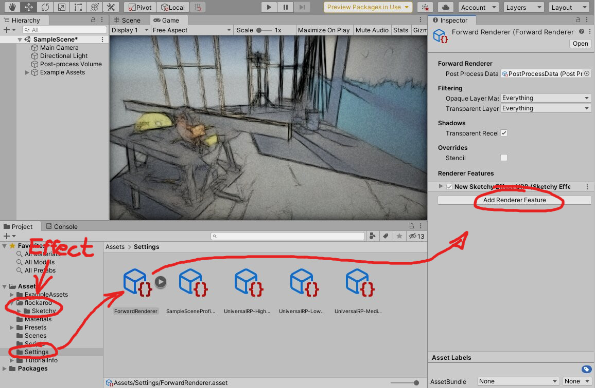

# Aquarelle - Unity3D Image Effect
#### (c) 2020 by [flockaroo](http://www.flockaroo.at) (Florian Berger) - email: <flockaroo@gmail.com>

******

### How to use

Select your camera node and then simply add "Aquarelle" script to camera components (can be found in Assets/flockaroo/Aquarelle/).
You can drag/drop it to there or choose it from the menu (Component/Scripts/Flockaroo/Aquarelle).

{ width="100%" }

__Warning!!__ The subfolder "flockaroo_Aquarelle" in "Resources" is needed by the effect script for unique identification of files and should not be removed or renamed.

### Parameters

The shader provides the following parameters:

#### Input/Output
 | Parameter       | function
 |-----------------|--------------
 | Input Texture   | take this texture as input instead of the camera
 | Render To Texture | render to texture instead of screen
 | Output Texture  | texture being rendered to if above is checked
 | Output Mipmap   | generate mipmap for output texture

#### Source Adjustments
 | Parameter       | function
 |-----------------|--------------
 | Src Brightness  | adjust source brightness
 | Src Contrast    | adjust source contrast
 | Src Color       | adjust source color

#### Effect
 | Parameter       | function
 |-----------------|--------------
 | Linear2Gamma    | the effect was originally made for gamma colorspace. if you use linear space (default in recent unity) check this box to get better results
 | Master Fade     | 1 = effect image ... 0 = original content
 | Content Vign Aspect | vignette aspect setting
 | Content Vign Sharp  | content vignette sharpness
 | Content Vign Size   | content vignette size
 | Paper Rough         | paper roughness
 | Predraw Strength    | predraw strength
 | Predraw Amount      | predraw number of lines (0=none 1=many)
 | FastGrad            | optimized for faster render (but looks slightly different)
 | Num Samples         | number of samples 2..64 (less samples -> faster but less quality)
 | Spread              | adjust how much aquarelle color spreads
 | Color Spread        | add variation to color spots
 | StrokeScale         | size of color spots
 | Rim Dry             | color spots darker on drying edge
 | Vignette            | strength of vignette
 | Mask Texture        | texture to mask the effect (0 no effect 1 full effect)
 | UseMask             | use Mask Texture [0..1]
<!--params-->

<!--##### Some Hints:
...-->

<!--

-->

#### Other
 | Parameter       | function
 |-----------------|--------------
 | Flip Y          | image Y flip
 | Geom Flip Y     | Y-flip of effect-internal geometry (use this if "Effect Fade" and "Pan Fade" wont work properly)
 | HDRP Gamma      | check this if you are using linear color space (only active in hdrp mode)
 
##### concerning "Flip Y" and "Geom Flip Y":
The screen coordinates of unity are a bit mysterious. even more when working on different platforms. The Y-coordinate seems to be flipped between versions even on the same system, and also flipped depending on the system.

So for "Flip Y" and "Geom Flip Y" follow these rules:

If you have the source ("Effect Fade" to 1) flipped and the effect correct, just check "Geom Flip Y".

If you have the source correct and the effect flipped, check both "Geom Flip Y" and "Flip Y". 

If both are equally flipped just check "Flip Y". 

### Color Spaces
All flockaroo-effects are initially designed for Gamma-Space. Gamma-space was the default in earlier versions.
At first HDRP came up with using HDR-Color space, which is a linear colorspace.
So in HDRP and URP versions there's an additional parameter named "HDRP Gamma", which should compensate for washing out contrasts in linear colorspace.
However in later versions linear color space is also being used in the Standard render-pipeline.
So all versions (std/URP/HDRP) have now an additional parameter "linear2Gamma", which should be enabled as soon as you are using linear color space.
As for today the "HDRP Gamma" parameter should be disabled in most cases. 
It can sometimes give better results e.g. in HDRP, but linear2Gamma should be disabled then. both being enabled won't make much sense in general.

### HDRP (disabled by default)
The hdrp file is disabled by default !!! here's how to use it:  
Unity wont compile this effect properly if no hdrp support is present
on your version, so in the hdrp ".cs" file in the very first line the "//#USE_HDRP" must be uncommmented to make use the hdrp effect. 
You also have to add it to the list of effects known to your project: 
"Edit/Project Settings... -> HDRP Default Settings -> After Post Process" 
..and then add it as an effect volume by clicking "Add Override" and the
selecting  "Post-processing/Custom/Flockaroo/..."  from the menu.

### URP (disabled by default)
The URP file is disabled by default !!! here's how to use it:  
Unity wont compile this effect properly if no URP-support is present
on your version, so in the urp "...URP.cs" file in the very first line the "//#USE_URP" must be uncommmented to make use the urp effect. 
Then under "Assets/Settings/ForwardRenderer" press "Add Renderer Feature" in the Inspector Tab.
In newer versions there are several URP Renderers URP Balanced, URP HighDynamic, URP Performant instead of Forward.
Beware: This must be the same Renderer as is configured under "ProjectSettings/Quality/Rendering". 
For older versions you might also want to comment the line "#define URP_VERSION_GE_13" for the effect to work. 
It should also run in Unity 6, but rendergraph needs to be disabled by switching to compatibility mode "Edit/ProjectSettings/Graphics/URP/RenderGraph"
 
 
{ width="100%" }
 
 
BEWARE!! For now the effect can not be used after Post Processing.  Furthermore some Post-Processing-Effects like "Bloom" dont work properly. Disable those effects for proper functionality.
